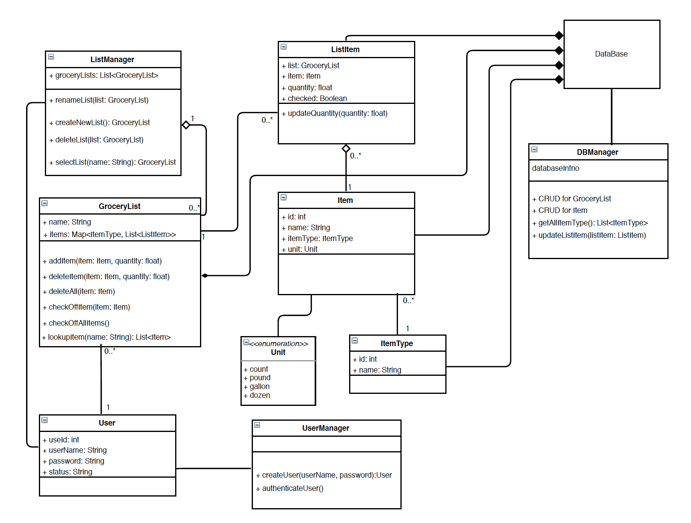
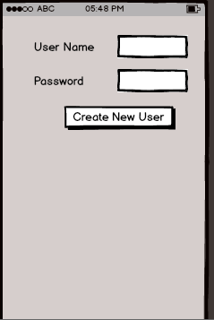
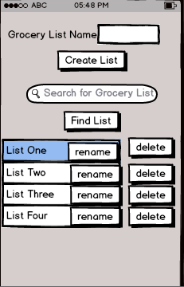
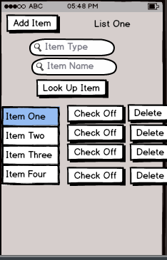
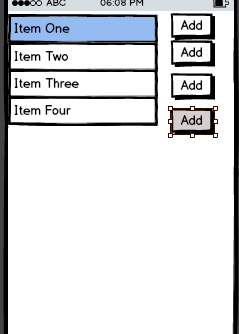

# Design Document

**Author**: Yihe Chen

## 1 Design Considerations

### 1.1 Assumptions

* ~~If the dataBase is unreachable for any reason, any instruction to alternate the grocery lists will fail and halt. The system "voids" the instruction, and logs the instruction as failed.~~ With the integration of Firebase, Firebase will handle all offline updates to the database and will make the update once connection is available.

* The ID of each user is an Integer unique for each user.

* The dataBase holds all the data of GroceryLists, ListItem, items, and itemTypes. Every time the system need the data of these objects, it needs to query the dataBase for the information. On the other hand, if the system needs to make any alternation to the dataBase, it will modify the objects in the dataBase by requesting the modification.

### 1.2 Constraints

* The system must interact with dataBase that requires Internet capabilities and will not function properly without Internet communication.

### 1.3 System Environment

The system will operate on any device capable of supporting Android API Level 19 (Kit Kat 4.4 or above). This application is intended to run on mobile devices. However, as the system utilizes the Android platform, it should be capable of porting to any android supported device.

The device running grocery list manager System must be be able to communicate with dataBase systems through the APIs provided by the dataBase service provider.

The application will use Firebase for its database component. Firebase is a mobile backend as a service that provides authentication and database support.

## 2 Architectural Design

### 2.1 Component Diagram

The system uses a Layered Architectural design. There are three distinct layers:
1. Presentation layer: This layer represents the User interface and that the end user uses to interact with the system.
2. Business logic layer: This layer represents the core business logic that is used to manage the grocery list system.
3. Persistence layer: This layer represents the database that is used to hold all application related data.

### 2.2 Deployment Diagram

The grocery List Management System is installed on any device running any Android package installer. As a private application, it would be to install in two ways:

1. Downloading the APK package, and installing it on the device with Android's Package Manager.

2. Plugging in the device to a computer. Running `adb install` to install APK.

3. To run on your device, download the APK to the android device and install the APK.

## 3 Low-Level Design

### 3.1 Class Diagram

#### 3.1.1 grocery List Management System

The grocery List Management System is the main tool for shop customers to editing and maintaining the stuff they are going to purchase. It also provides all the functionality necessary for customer to search, locate items by name and type.

#### 3.1.2 DataBase

The grocery List Management System communicates with the dataBase in order to retrieve and modify the information concerning the grocery list. The grocery List Management System must provide the dataBase with data in a format that following the API supported by the dataBase.

Communications trail:
* Query (grocery List Management System -> DataBase): There are two kinds of queries. 1. Grocery List Management System queries the dataBase for item by name. 2. Grocery List Management System queries dataBase with hierarchical query
* Output (DataBase -> Grocery List Management System): DataBase return the query result to Grocery List Management System.
* Modify (Grocery List Management System -> DataBase): The Grocery List Management System send modification instructions to dataBase. The Grocery List Management System must provide the exact object it is going to modify and the field it is going to modify.
* Output (DataBase -> Grocery List Management System): The dataBase return the result of modification.

Firebase Realtime Database will be used for the Android app. This will help maintain the user logins and all persistent data for GLM. Firebase stores and syncs data with NoSQL cloud database. Data is synced across all clients in realtime, and remains available when your app goes offline. Data is stored as JSON and synchronized in realtime to every connected client.

## Classes

### System

#### 1.  UserManager

This class is responsible for creating a user in the system. This class will be automatically created once the system starts.

#### 2. User

The class User is a representation of a customer in the shop. It stores:
1. UserID
2. UserName
3. password
4. status

#### 3. ListManager

This class is the main class that receives instructions from user and manage the grocery lists.

#### 3. DBManager

This class is used to manage the dataBase.

### Data

#### 1. GoceryList

This class corresponds to an grocery list. It stores the name and items that are in the grocery list. It supports following instructions of modifying the list:
1. addItem
2. deleteItem
3. checkOffItem
4. chekcOffAllItem
5. lookupItem

#### 2. ListItem

This class corresponds to the item that is added to the grocery list. This class will store the GroceryList in order to know to which the item belongs

#### 3. item

This class corresponds to the items that could be add to the list.

#### 3. itemType

This class corresponds to the itemType.

### Enumerations

#### 1. Unit

Used to determine the amount of item.

## 5 User Interface Design

|Create User|List Manager|List Modification|Add Item|
|---|---|---|---|
|||||
