# Test Plan

**Author**: \<Shean Kim\>

## 1 Testing Strategy

### 1.1 Overall strategy

The overall strategy is to provide testing frequently during the development process. We will all manual test all functionality and report issues raised in our task management system. Beta testing will be used to test whether the app as a whole is working as intended. This will be done by the team.

### 1.2 Test Selection

As part of the testing process, there are many different types of testing used for different purposes. The black box testing strategies are used to validate that the requirements were completed. Because of the simple logic and mobile nature of the application, system testing is the only thing that is required. Because of the integration with a 3rd party service for the database component, it is difficult to mock the persistence layer to test. However, complexity is simple enough to get all coverage of requirements by hand.

 - System testing: This will be done to test the application holistically and to determine if the app is meeting requirements. This will be done via beta testing the application and manually going through test cases and reporting results.

### 1.3 Adequacy Criterion

Adequacy and quality of the tests will be measured by attempting to fulfill every requirement given (nonfunctional and functional)

### 1.4 Bug Tracking

Github will be used to keep track of bugs and enhancement by creating issues. Pull requests will be made for team members to review other codes to find bugs as soon as possible.

### 1.5 Technology

Android studios is used for development and its debugger is used to determine any mistakes in logic. Github is our task management system and is used to track all issues and bugs. Github will also host a requirements document that will be used to record the results of testing.

## 2 Test Cases

| #  |    Test Case                                |    Purpose                                                                                                                                                                                                                                                                                                                                                                                  |    Steps                                                                                                                                                                                                                                                                                                                                                                                                                                                                                                                           |    Expected                                                                                                                       |    Actual                                                                                                                                                 |
|----|---------------------------------------------|---------------------------------------------------------------------------------------------------------------------------------------------------------------------------------------------------------------------------------------------------------------------------------------------------------------------------------------------------------------------------------------------|------------------------------------------------------------------------------------------------------------------------------------------------------------------------------------------------------------------------------------------------------------------------------------------------------------------------------------------------------------------------------------------------------------------------------------------------------------------------------------------------------------------------------------|-----------------------------------------------------------------------------------------------------------------------------------|-----------------------------------------------------------------------------------------------------------------------------------------------------------|
| 1  |    User Login Success                       |    Test to see if the user is able to successfully login.                                                                                                                                                                                                                                                                                                                                   |    1.         Launch the app   2.         Key in proper credentials –   Email and Password   3.         Tap the Login Button                                                                                                                                                                                                                                                                                                                                                                                                       |    Successful login                                                                                                               |    Logged in Successfully   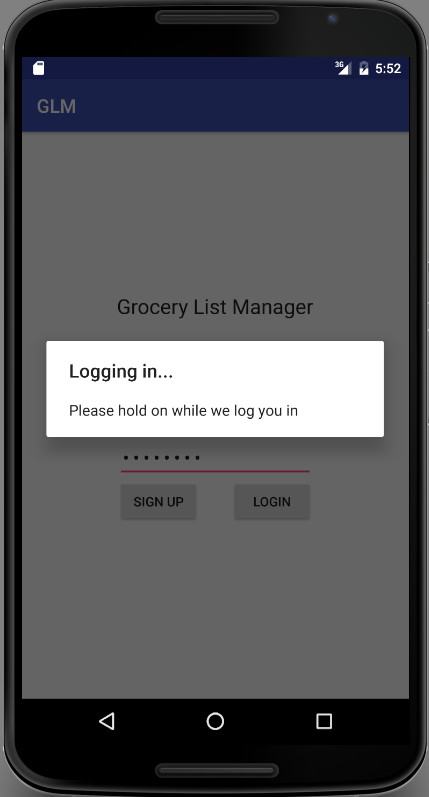                                                                                                                               |
| 2  |    User Login Fail                          |    Test to see  if the user   login fails with invalid credentials                                                                                                                                                                                                                                                                                                                          |    1.         Launch the app   2.         Key in invalid credentials –   Email and Password   3.         Tap the Login Button                                                                                                                                                                                                                                                                                                                                                                                                      |    Unable to login. A message is presented that there is no user   record                                                         |    Unable   to login. A message is presented that there is no user   record           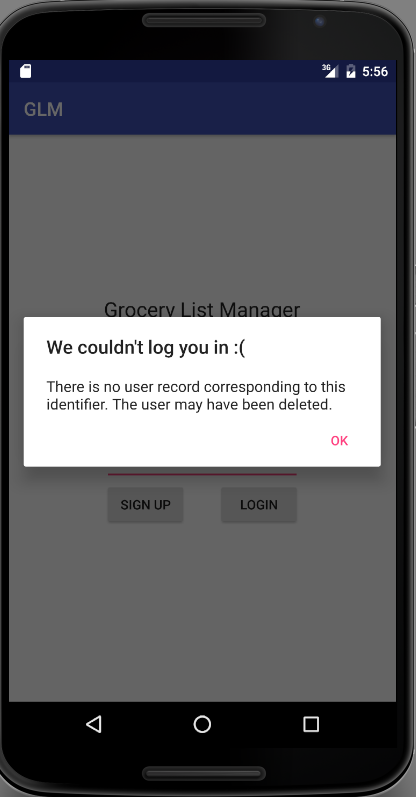                                                                  |
| 3  |    Sign Up for Login                        |    Test to see if signing up for Login works                                                                                                                                                                                                                                                                                                                                                |    1.         Launch the app   2.         Tap the “Sign Up” button.   3.         This launches the Register   screen.    4.         Enter Email Address and   Password.   5.         Tap “Register” button.                                                                                                                                                                                                                                                                                                                        |    User Login will be registered in the database and home page is   presented.       |    User is able to sign up and home page is   presented.            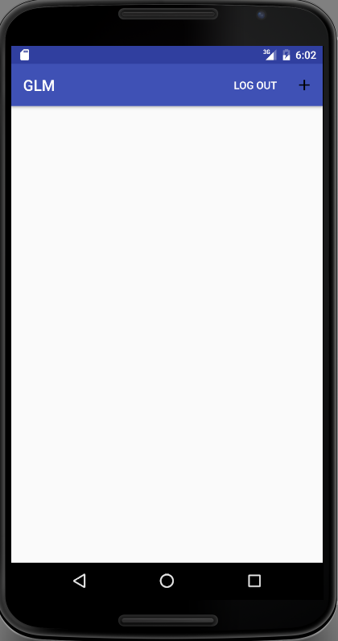                                                                  |                                            |                                                                                                                                                           |
| 4  |    Create list                              |    Test if user is able to create multiple Lists                                                                                                                                                                                                                                                                                                                                            |    1.         After Login, click on “+” from GLM   home screen.   2.         Enter Grocery List Name in the   dialog window that opens and click “Create List”   3.         Grocery list with the name   entered in step 2 is created                                                                                                                                                                                                                                                                                              |    List should be created and persisted                                                                                           |    New   List “Weekly Grocery List” created and saved in the database.         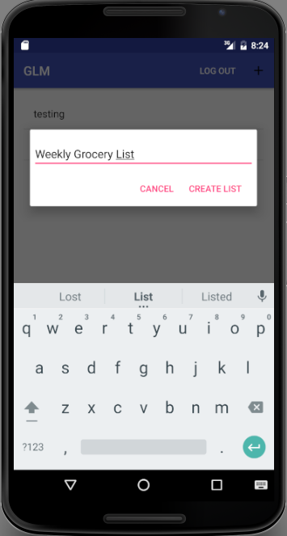                                                                           |
| 5  |    Delete list                              |    Test if user is able to delete list                                                                                                                                                                                                                                                                                                                                                      |    1.         Open a Grocery List from GLM   home screen by tapping the grocery list name. This opens the Grocery   List   2.         Click “trash can” icon on top   menu.    3.         Confirmation Message “Do you   want to delete the list?” pops up.   4.         Click “OK” on confirmation   message to delete the grocery list and return to the GLM home screen.                                                                                                                                                |    List should be deleted and no longer persisted                                                                                 |    List   should be deleted from the database       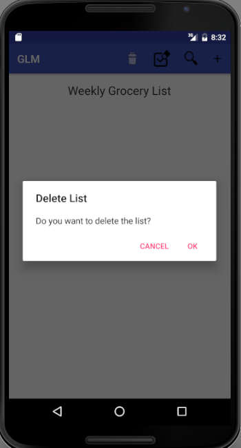                                                                                                      |
| 6  |    Rename list                              |    Test if user can rename an existing list                                                                                                                                                                                                                                                                                                                                                 |    1.         Long click one of the Grocery   List name that you would like to rename from GLM home screen   2.         This opens a pop-up dialog   window to enter the new list name. Enter the new list name.   3.         Click “Rename” on pop-up   window.                                                                                                                                                                                                                                                                   |    List should be renamed and persisted                                                                                           |    List is renamed and saved to the database.      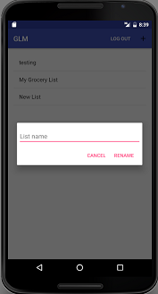                                                                                                       |
| 7  |    Add preexisting item                     |    Users   must be able to add items to a list by picking them from a hierarchical list,   where the first level is the item type and the second level is the name of   the actual item. After adding an item, users must be able to specify a   quantity for that item                                                                                                                     |    1.         Open a Grocery List from GLM   home screen by tapping the grocery list name. This opens the Grocery   List   2.         Click “search” icon on top   menu.   3.         This opens a pop-up window “Search   an Item”.    4.         Select Item Type and Item Name   from the hierarchical list.   5.         Enter Quantity and select unit   of measure   6.         Click “Create Item”.                                                                                                                 |    Item should be added with selected type                                                                                        |    Item with the selected item is saved to the database and added   to the grocery list.   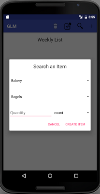                                                               |
| 8  |    Add item with new type                   |    Users   must be able to specify an item by typing its name. In this case, the   application must look in its DB for items with similar names and ask the   users, for each of them, whether that is the item they intended to add. If a   match cannot be found, the application must ask the user to select a type for   the item and then save the new item, together with its type    |    1.         Open a Grocery List from GLM   home screen by tapping the grocery list name. This opens the Grocery   List   2.         Click “+” icon on top menu.   3.         This opens a pop-up window “Add   an Item”.    4.         Enter at least 2 characters to search   and list items in the database with similar names.   5.         If there is a match, select the   item. If there is no match, enter the item name, select item type, enter quantity,   select unit of measure and click “Create Item”.    |    Item should be added to list and new item should be added to   database layer                                                  |    Item is added to the grocery list. If the item is not found,   it is saved to the database.       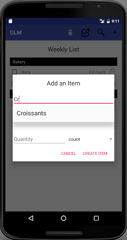       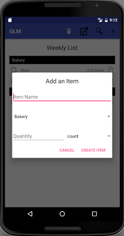                                              |
| 9  |    Delete item from list                    |    The   app must allow users to delete items from a list.                                                                                                                                                                                                                                                                                                                                  |    1.         Open a Grocery List from GLM   home screen by tapping the grocery list name. This opens the Grocery   List   2.         Click “trash can” icon next to one   of the item.                                                                                                                                                                                                                                                                                                                                    |    Item should be removed from list                                                                                               |    Item is deleted from the grocery list      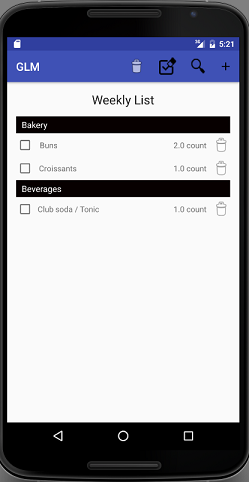                                                                                                            |
| 10 |    Change quantity of item                  |    The   app must allow users to change the quantity of items in the list.                                                                                                                                                                                                                                                                                                                  |    1.         Open a Grocery List from GLM   home screen by tapping the grocery list name. This opens the Grocery   List   2.         Tap trashcan to delete the item   3.         Create new item with new quantity .                                                                                                                                                                                                                                        |    Item quantity should be changed and persisted                                                                                  |    Item quantity is changed and saved to the database.                                                                                                    |
| 11 |    Check item from list                     |    Users must be able to check off items   in a list (without deleting them).   Check-off   marks for a list are persistent and must also be saved immediately                                                                                                                                                                                                                              |    1.         Open a Grocery List that has   items from GLM home screen by tapping the grocery list name. This   opens the Grocery List   2.         Click the checkboxes next to   the items.    3.         Return to the home screen and   re-open the same grocery list as in step 1.                                                                                                                                                                                                                                   |    Items should be checked off but not deleted from the list. The   checked off items are still checked on re-opening the list    |    Items are checked off from the list and not deleted. Checked   off items are saved to the database and still checked on re-opening the list.   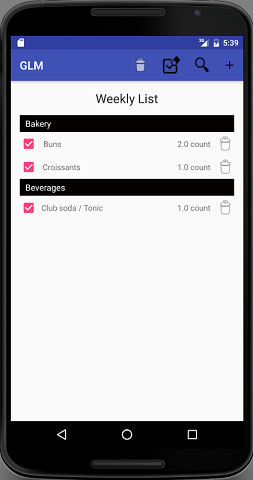        |
| 12 |    Clear All checks from list               |    Users must be able to clear all the   check-off marks in a list at once.                                                                                                                                                                                                                                                                                                                 |    1.         Open a Grocery List that has   items from GLM home screen by tapping the grocery list name. This   opens the Grocery List   2.         Click the “Clear Al Checkboxes”   icon next to the trash can icon on top menu.                                                                                                                                                                                                                                                                                        |    All check-off marks in the list should be cleared at once.                                                                     |    All check-off marks for items in the list are cleared at once and   database is updated.      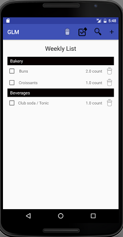                                                         |
| 13 |    List should separate items into types    |    The   application must present the items in a list grouped by type, so as to allow   users to shop for a specific type of products at once (i.e., without having   to go back and forth between aisles).                                                                                                                                                                                 |    1.         Open a Grocery List from GLM   home screen by tapping the grocery list name. This opens the Grocery   List   2.         Review the items added to the   list.                                                                                                                                                                                                                                                                                                                                                |    List should have all items grouped by type and sorted   alphabetically                                                         |    All items are grouped by appropriate item types and sorted.      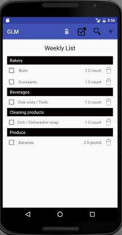                                                                                      |
| 14 |    Select type of item when adding item     |    User should be able to choose the item type when adding items                                                                                                                                                                                                                                                                                                                            |    1.         Open a Grocery List from GLM   home screen by tapping the grocery list name. This opens the Grocery   List   2.         Click “+” icon on top menu.   3.         This opens a pop-up window “Add   an Item”.    4.         Enter the Item Name.    5.         Select the dropdown for item   type to see all item types to choose from    6.         Choose an item type, enter quantity,   choose unit of measure and click “Create Item”                                                                   |    Item Type field should show various types of items to choose   from and save the item and item type to the grocery list        |    Item type field shows all item types and saves the item name   entered and item type chosen to the database.       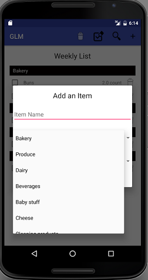                                    |
| 15 |    Select item of type                      |    User should be able to select items of a particular type                                                                                                                                                                                                                                                                                                                                 |    1.         Open a Grocery List from GLM   home screen by tapping the grocery list name. This opens the Grocery   List   2.         Click “search” icon on top   menu.   3.         This opens a pop-up window “Search   an Item”.    4.         Select Item Type dropdown to   see all items for that type.    5.         Chose Item Name from the   hierarchical list based on item type selected.   6.         Enter Quantity and select unit   of measure.   7.         Click “Create Item”.                         |    Various items of the chosen type should be shown in ‘Search   and Item’ pop-up and the item is created.                        |    All Items for the chosen Item type in the database is shown   and the item is created and added to the grocery list.     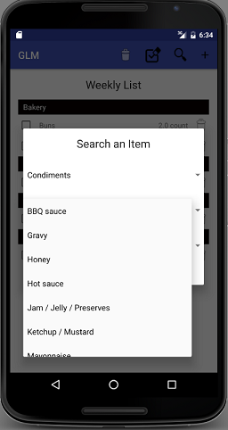                              |
| 16 |    Select item by typing name               |    User should be able to search for item by entering few   characters of the name                                                                                                                                                                                                                                                                                                          |    1.         Open a Grocery List from GLM   home screen by tapping the grocery list name. This opens the Grocery   List   2.         Click “+” icon on top menu.   3.         This opens a pop-up window “Add   an Item”.    4.         Type in item name.   5.         This initiates a search and lists   items in the database with similar names if there is a match.   6.         Select the item.   7.         Select item type, enter quantity,   select unit of measure and click “Create Item”.                  |    Shows items based on text input and the item is added.                                                                         |    Items are listed based on input text and the item is added to the   grocery list.     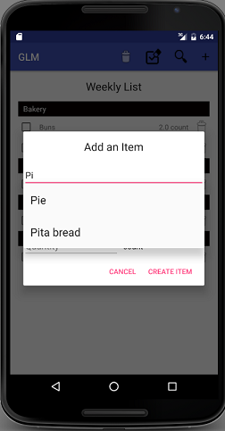                                                                 |
| 17 |    User Logout                              |    User should be able to logout from the app.                                                                                                                                                                                                                                                                                                                                              |    1.         On the GLM home screen, tap “LOGOUT”   icon on top menu.   2.         A confirmation message “Are you   sure you want to log out?” pops up.    3.         Click “Yes” to logout from the app                                                                                                                                                                                                                                                                                                                         |    User should be logged out                                                                                                      |    User is logged out from the app and presented with the login   screen.       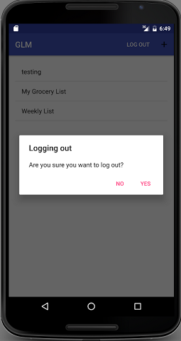                                                                          |
