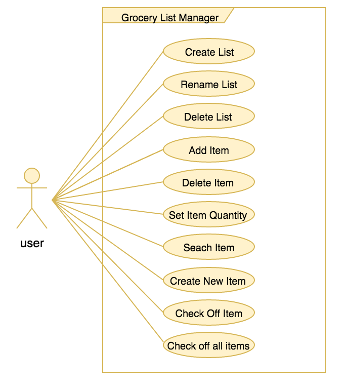

# Use Case Model

**Author**: team #10

## 1 Use Case Diagram

## 2 Use Case Descriptions

### Create List

- *Requirements: The user should be able to create a new shopping list*
- *Pre-conditions: List with the same name should not exist.*
- *Post-conditions: List must be created with the provided name.*
- *Scenarios:* 
	- *User clicks on create new list button* 
	- *The system prompts the user to specify the name of the list*
	- *User provides a unique name*
	- *The system checks the name does not exist and saves it to the database* 
	- *If the name already exists the system prompts the user to provide a different name*

### Rename List

- *Requirements: The user should be able to update the name of an existing list.*
- *Pre-conditions: List must be created and should exist.*
- *Post-conditions: List must be updated with the provided new name.*
- *Scenarios:* 
	- *User selects an existing list* 
	- *User selects the name of the existing list*
	- *User provides a new name*
	- *The system saves the new name automatically to the database* 

### Delete List

- *Requirements: The user should be able to delete an existing list.*
- *Pre-conditions: List must be created and should exist.*
- *Post-conditions: List must be removed from the system*
- *Scenarios:* 
	- *User selects an existing list* 
	- *User clicks on a link to delete the list*
	- *The system removes the list from the database* 

### Add Item

- *Requirements: The user should be able to add item to and existing list.*
- *Pre-conditions: List must be created and should exist.*
- *Post-conditions: Item must be added to the list.*
- *Scenarios:* 
	- *User selects an existing list* 
	- *User types in the name of the item*
	- *The system looks up the item from the database based on the item name.*
	- *If the Item does not exist the system prompts the user to save it as a new Item.*
	- *The user types in the quantity of the item* 

### Delete Item

- *Requirements: The user should be able to delete item from a list.*
- *Pre-conditions:The item must exist in the selected list.*
- *Post-conditions:The item is removed from the selected list.*
- *Scenarios: * 
	- *The user selects a list * 
	- *The user selects an item and clicks on the delete link *
	- *The system removes the item for the list and saves the change to the database automatically *

### Set Item Quantity

- *Requirements: The user should be able to update the quantity of an item in a list.*
- *Pre-conditions:The item must exist in the selected list.*
- *Post-conditions:The quantity of the item is updated to the new quantity provided.*
- *Scenarios: * 
	- *The user selects a list* 
	- *The user selects an item in a list*
	- *The user enters a new quantity value for the selected item*
	- *The system saves the new quantity to the database automatically*

### Search Item

- *Requirements: The user should be able to search Items in the database by name or category.*
- *Pre-conditions:None .*
- *Post-conditions:The system displays the item if the item exists or ask the user to create the item if it does not exist .*
- *Scenarios: * 
	- *The user selects an existing list* 
	- *The user types in the item name*
	- *The system searches in the database using the item name*
	- *If the item exists the system displays the item to the user*
	- *If the item does not exist the system asks the user to save the new item to the database *

### Create New Item

- *Requirements: The user should be able to save new items to the database.*
- *Pre-conditions:Item must not exist in the database.*
- *Post-conditions:Item is saved to the database.*
- *Scenarios: * 
	- *The user selects an existing list * 
	- *The user types in the item name*
	- *The system searches for the item name in the database*
	- *If the item does not exist in the database the system asks the user to save the new item*
	- *The user specifies the type of the item*
	- *The system saves the item in the database*

### Check Off Item

- *Requirements: The user should be able to check off an item in a list.*
- *Pre-conditions:The item should exist in a selected list.*
- *Post-conditions:The item is checked off from the selected list.*
- *Scenarios: * 
	- *The user selects an item on an existing list* 
	- *The user clicks on the check off link next to the item name to check of the item*
	- *The system updates the item as checked off and saves the change to the database*

### Check Off All Items

- *Requirements: The user should be able to check off all items in a list.*
- *Pre-conditions:One or more items should exist in a selected list.*
- *Post-conditions:All items are checked off from the selected list.*
- *Scenarios: * 
	- *The user selects an existing list* 
	- *The user clicks on the check-off all items link*
	- *The system updates all items in the list as checked off and saves the change to the database*

