# User Manual

## 1.0	Sign up/Login/Logout

### 1.1	Sign up for a Login

If you do not have a login for GLM, you can register for an login from the app.

1.	To sign up for a Login, launch GLM App and click the “SIGN UP” button. This launches the Sign up screen.

 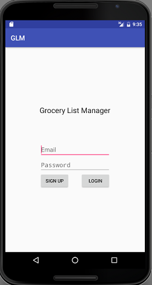

2.	Fill in all fields – Email and Password with appropriate data and click “Register”.

 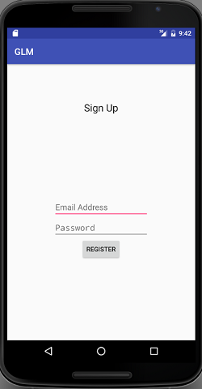

3.	After the user is registered, you will taken to the home screen/landing page.

 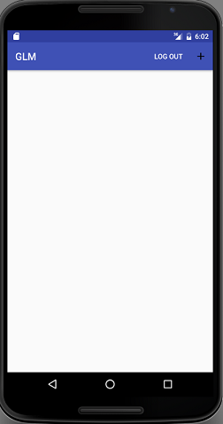

### 1.2	Login

1.	Launch GLM app.
2.	Enter your Email and Password. Click "LOGIN" button.

 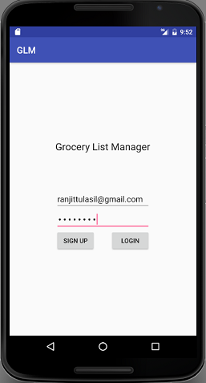

3.	If login details are valid, you will see the home screen with any Grocery Lists you have created and options to create a new Grocery List.

### 1.3	Logout

1.	Tap LOG OUT on top menu on home/landing screen.
2.	Tap "OK" on the confirmation message that pops-up.

 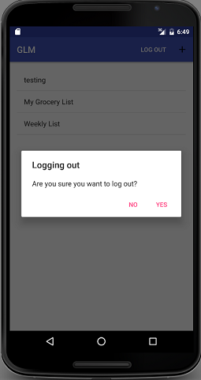

3.	You are now logged out of the app and presented with the login screen.

## 2.0	Viewing Grocery Lists

### 2.1	View All Grocery Lists

1.	On Login, you will be taken to the View All Grocery Lists screen.
2.	Grocery List screen lists all grocery lists you have created.

 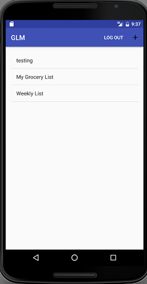

### 2.2	View Grocery List <List Name>

1.	To view a particular Grocery List, tap on the Grocery List Name.
2.	This will open up the Grocery List with the items sorted by item type.

 

## 3.0	Manage Grocery List

### 3.1	Create Grocery List

1.	Go to the home screen that lists all Grocery lists.
2.  To create a new Grocery List, tap the "+" icon on the top menu.
2.	This brings up a pop-up window to create a new grocery list.
3.	Enter the “List Name” and tap “Create List” to create the list.

 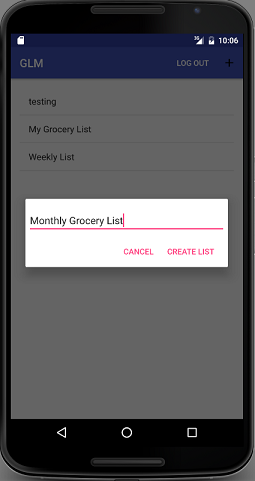

### 3.2	Rename Grocery List

1.	From the home screen, long tap the Grocery list Name that you wish to rename.
2.	This brings up the rename pop-up screen.
3.	Enter the new name for the list and click “RENAME”.

 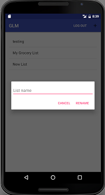

4.	This will rename the list and take you back to the View Grocery List home screen.

### 3.3	Delete Grocery List

1.	From the home screen, open the Grocery list that you wish to delete by double-clicking the on the Grocery List Name.
2.	Click the "trash can" delete icon from the top menu.
3.	This brings up the delete list confirmation message: "Do you want to delete the list?".
4.	Click "OK" to delete the list.

 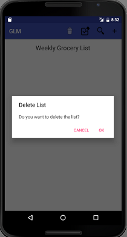

4.	This will delete the list and take you back to the View Grocery List home screen..  

## 4.0	Manage Items

### 4.1	Add Item

1.	Open the grocery List you would like to add an Item.
2.  Click the “+” icon on the top menu.
3.	This brings up the “Add an Item” pop-up window.
4.  Type in “Item Name".
5.  As you type in the item name, a list of items that match the characters entered will be listed.
6.  Pick the item from the list if it exists.

 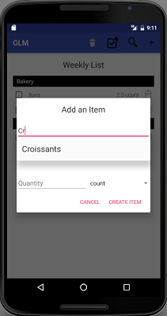

7.  If the item does not exist in the list, type in the full item name.
8.  Select “Item Type” from the next dropdown list, enter “Quantity” and select "Unit of measure" from the dropdown list.

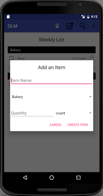

9.  Click "Create Item" to add the item to the list.

### 4.2	Search and Add Item

1.	Open the grocery List you would like to add an Item.
2.  Click the “magnifying glass” search icon on the top menu.
3.	This brings up the Search an Item” pop-up window.
4.  Select the “Item Type" for the item you would like to add.
5.  Choose the item from the item dropdown list.

 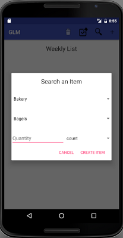

6.  Enter “Quantity” and select "Unit of measure" from the dropdown list.
7.  Click "Create Item" to add the item to the list.

### 4.3	Delete Item

1.	Click the "trash can" delete icon next to the item you want to delete in the grocery list.

 

2.	This deletes the item from the grocery list.

### 4.4	Change Quantity

1.  Open the Grocery List you would like to change quantity for an item.
2.	To change quantity, delete the item and recreate the item with the new quantity amount.

 

### 4.5	Check off Items

1.  Open the Grocery List.
2.	To check off an item in the list, click the checkbox next to the item in the Grocery List.

 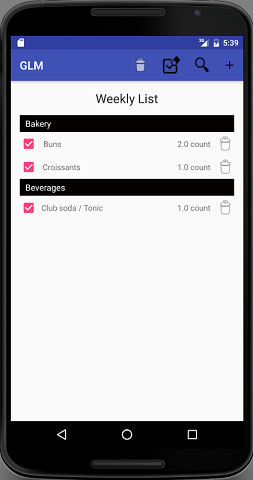

### 4.6	Clear All Checked-off Items

1.  Open the Grocery List.
2.	To clear all items checked-off, click “Clear All” icon on the top menu.

 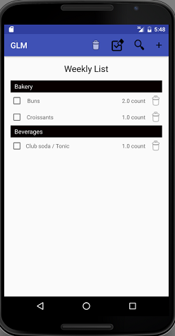
